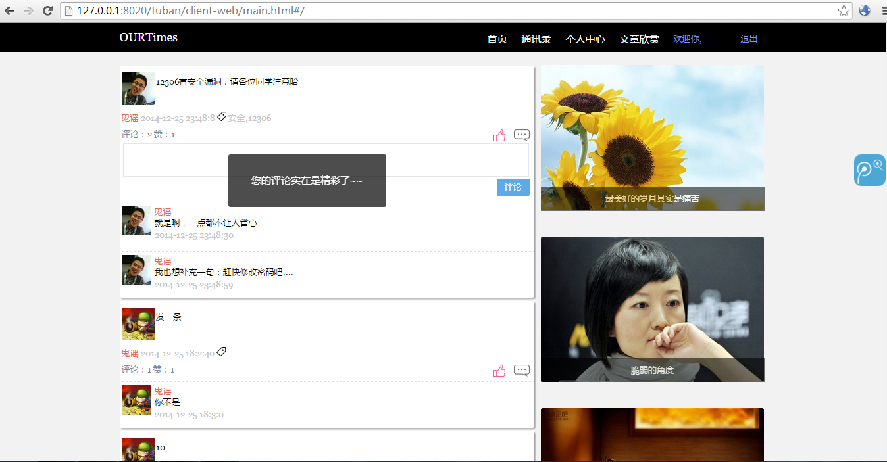
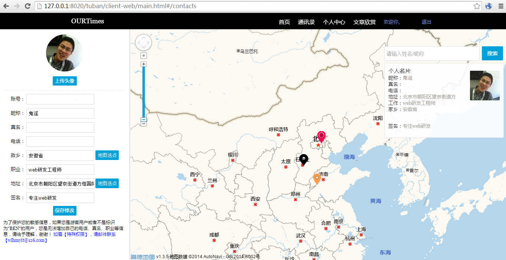
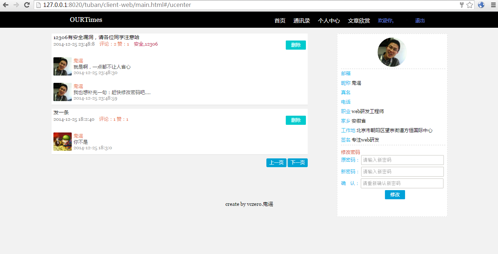

OurTimes：基于位置的通讯录
---------------------------------------
[体验地址http://vczero.github.io/tuban/main.html#/](http://vczero.github.io/tuban/main.html#/)   
[服务端代码](https://github.com/vczero/OurTimes/tree/master/server)      
[客户端代码](https://github.com/vczero/OurTimes/tree/master/client-web)      
[后台代码](https://github.com/vczero/OurTimes/tree/master/client-admin)   
[项目配置](https://github.com/vczero/OurTimes/tree/master/%E9%85%8D%E7%BD%AE%E7%9B%B8%E5%85%B3)  

+ 通讯录功能
+ 微博功能    
+ 分享功能  
+ 位置功能       

####写在前面
1. 注册的用户分为guest、ben(本班同学)、admin三种；
2. 所有用户注册完成后，都是guest；本班同学我会在后台设置为ben用户；
3. 其中邮箱注册可以不是自己的邮箱，后缀名也可以自拟，目的是方便体验的同学
可以放心注册，浏览guest用户信息(去除了敏感信息)。
4. 当然，作为guest用户，是无法看到ben用户的信息。

####一、技术方案
**N**ode.js + **A**ngularJS + **M**ongoDB
####二、项目
+ client-web：OurTimes主站
+ client-admin：后台管理系统
+ client-webkit:node-webkit打包后台    
   
####三、说明
时间匆忙，主要是为了练习angular.js,所以有很多地方比较粗糙，同时也没有使用jquery类库。秉着“小步快跑，不断迭代”的策略，后续针对特定功能使用最佳实现方式，比如后台的文章管理，采用richEdit等等。至于Node.js实现服务，我个人觉得服务功能单一化更好，这样，node.js服务的维护较为便利。后期，会根据业务的复杂程度，采用async等库进行优化。 开源的代码和线上部署的代码所有配置不一样，所以大家可以根据自己的需要配置。我这里，数据库服务部署在阿里云，静态文件服务器就交给Github page啦！    
    
####四、部署 && 配置
1. pc端：client-web文件夹，修改相关配置，部署静态文件服务器即可
2. 后台：client-admin:简易的后台管理系统。 
     
####五、项目截图
**1**. 首页：发表微博、点赞、评论、欣赏文章

**2**. 通讯录:你会看到其他用户地图分布、修改个人信息、地图搜索

**3**. 个人中心：删除以前微博、修改密码

**4**. 文章欣赏：根据首页导过来的链接欣赏美文

