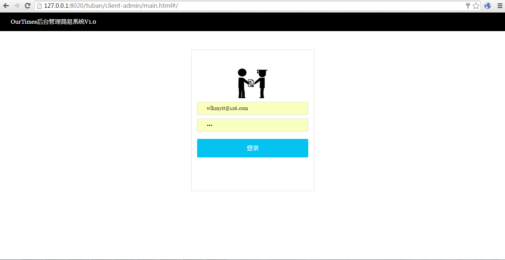
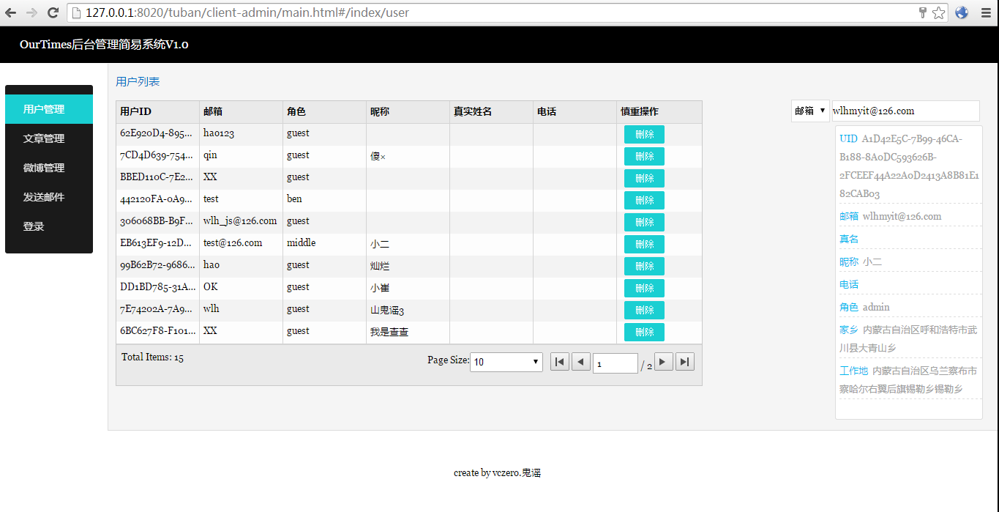
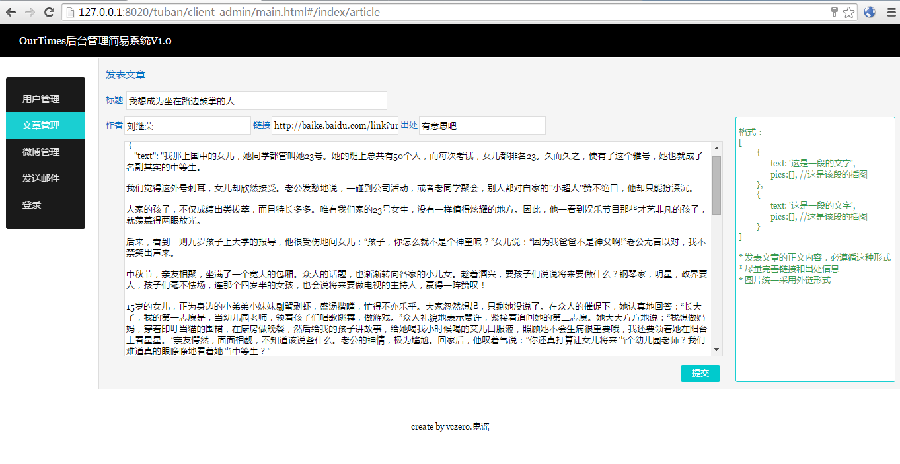
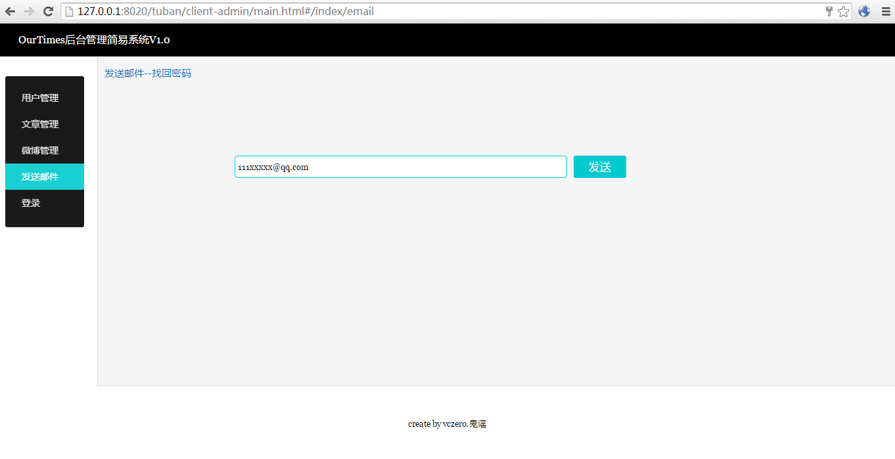

OurTimes简易后台管理系统
-------------------------
关键字：简单、简约、必要功能 V1.0
####主体功能：
+ 用户管理(查询、更新、删除、浏览信息)
+ 文章管理(按照一定格式发表文章，不是富文本模式)
+ 微博管理(根据不同条件查询，在慎重的情况下，判断敏感微博信息)
+ 发送邮件(给找回密码的用户发送系统邮件，密码随机生成)

####启动
 0. 按照server文件下的config.json创建MongoDB数据库和认证
 1. cd server && npm install && node app.js 启动服务   
 2. 修改client-admin的lib下main.js中的服务URL配置
 3. 将client-admin拷贝到静态文件服务器下(nginx、apache...),当然可以使用HBuilder打开整个项目，在client-admin的main.html上启动(HB默认开启一个微型静态文件服务器)。    
 4. 输入网址例如：http://127.0.0.1:8020/tuban/client-admin/main.html#/  

####说明
+ MongoDB数据库名称、表名、地址都是线下地址【非线上版本】
+ 所有服务和数据需要自己创建，在创建数据库的时候，给定一个管理员用户，管理员用户的tag为{tag:'admin'}。

####系统截图
######登录

######用户管理

######文章管理

######微博管理

######发送邮件

 
 